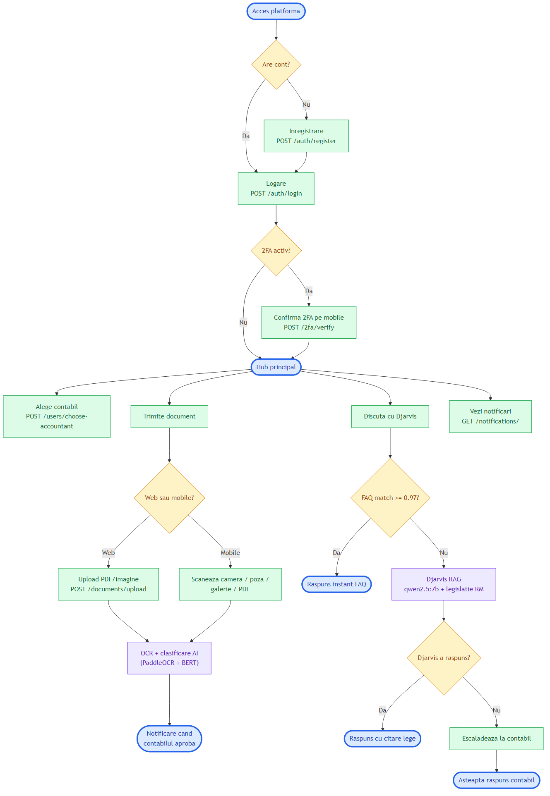
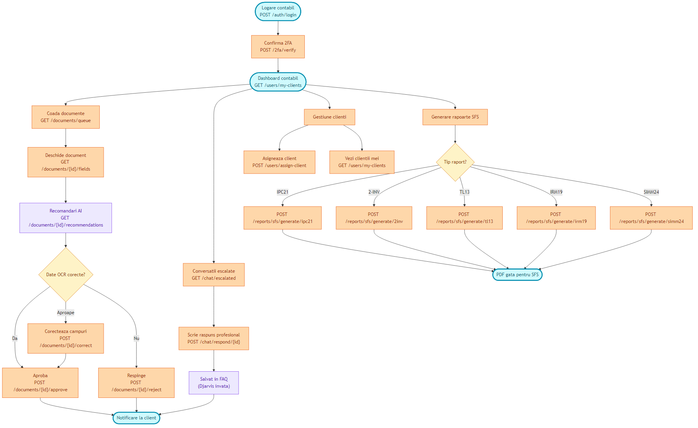
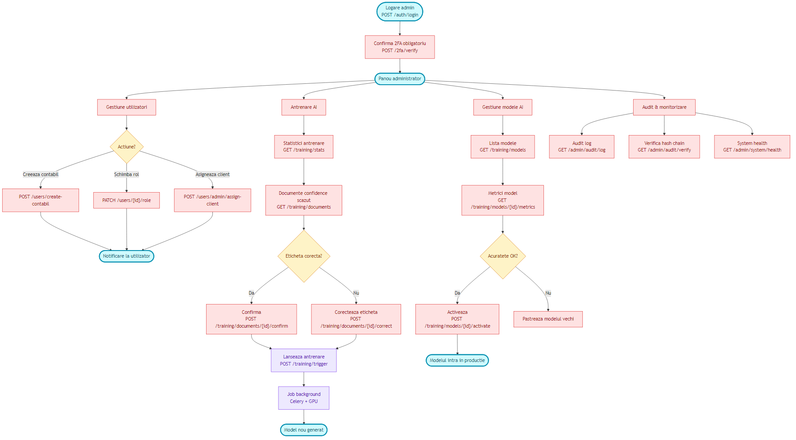

# Scheme de flux pe roluri — Platforma AI-Contabil

Schemele de mai jos descriu pașii reali pe care fiecare tip de utilizator
(Client, Contabil, Administrator) îi parcurge în platformă, mapați direct
pe rutele și endpoint-urile existente în cod.

---

## 1. Flux Client

Clientul este utilizatorul final — antreprenor / freelancer / angajat care
trimite documente și pune întrebări de contabilitate.



**Endpoint-uri cheie folosite:**
- `POST /api/v1/ac/auth/register` — inregistrare cont
- `POST /api/v1/ac/auth/login` — autentificare
- `POST /api/v1/ac/users/choose-accountant` — alegere contabil
- `POST /api/v1/ac/documents/upload` — incarcare document
- `POST /api/v1/ac/chat/send` — trimite mesaj catre Djarvis
- `GET /api/v1/ac/notifications/` — lista notificari

---

## 2. Flux Contabil

Contabilul verifica documentele clientilor sai, raspunde la intrebari
escaladate de Djarvis si genereaza rapoarte fiscale catre SFS.



**Endpoint-uri cheie folosite:**
- `GET /api/v1/ac/users/my-clients` — clientii contabilului
- `GET /api/v1/documents/queue` — coada de documente de verificat
- `POST /api/v1/documents/{id}/approve` — aprobare document
- `POST /api/v1/documents/{id}/correct` — corectie campuri OCR
- `POST /api/v1/ac/chat/respond/{conversation_id}` — raspuns la conversatie escalata
- `POST /api/v1/ac/reports/sfs/generate/{tip}` — generare raport SFS

---

## 3. Flux Administrator

Administratorul gestioneaza utilizatorii (creeaza contabili, schimba roluri),
antreneaza modelele AI, monitorizeaza sistemul si verifica audit-ul.



**Endpoint-uri cheie folosite:**
- `POST /api/v1/ac/users/create-contabil` — creare cont contabil
- `PATCH /api/v1/ac/users/{id}/role` — schimbare rol utilizator
- `GET /api/v1/training/stats` — statistici antrenare model
- `POST /api/v1/training/trigger` — lansare proces de antrenare
- `POST /api/v1/training/models/{id}/activate` — activare model nou
- `GET /api/v1/admin/audit/log` — log audit operatiuni critice
- `GET /api/v1/admin/system/health` — verificare sanatate servicii

---

## Legenda culori

| Categorie | Culoare | Semnificatie |
|-----------|---------|--------------|
| **Hub / Start / End** | albastru deschis | Punct de intrare/iesire intr-un flux |
| **Actiuni client** | verde | Operatiuni initiale ale clientului |
| **Actiuni contabil** | portocaliu | Verificari, aprobari, rapoarte |
| **Actiuni admin** | rosu | Operatiuni privilegiate (sensibile) |
| **AI / Djarvis / OCR** | mov | Componente automatizate (OCR, RAG, training) |
| **Decizii** | galben | Puncte unde fluxul se ramifica |

---

## Surse Mermaid (pentru re-generare)

Sursele `.mmd` ale celor 3 scheme sunt in [`figuri/scheme/`](figuri/scheme/):
- [`flux_client.mmd`](figuri/scheme/flux_client.mmd)
- [`flux_contabil.mmd`](figuri/scheme/flux_contabil.mmd)
- [`flux_admin.mmd`](figuri/scheme/flux_admin.mmd)

Pentru re-generare dupa modificari, ruleaza din folderul `teza/figuri/scheme/`:

```bash
npx -y -p @mermaid-js/mermaid-cli mmdc -i flux_client.mmd   -o flux_client.png   -w 1600 -H 2000 -b white
npx -y -p @mermaid-js/mermaid-cli mmdc -i flux_contabil.mmd -o flux_contabil.png -w 1800 -H 2200 -b white
npx -y -p @mermaid-js/mermaid-cli mmdc -i flux_admin.mmd    -o flux_admin.png    -w 1800 -H 2200 -b white
```
